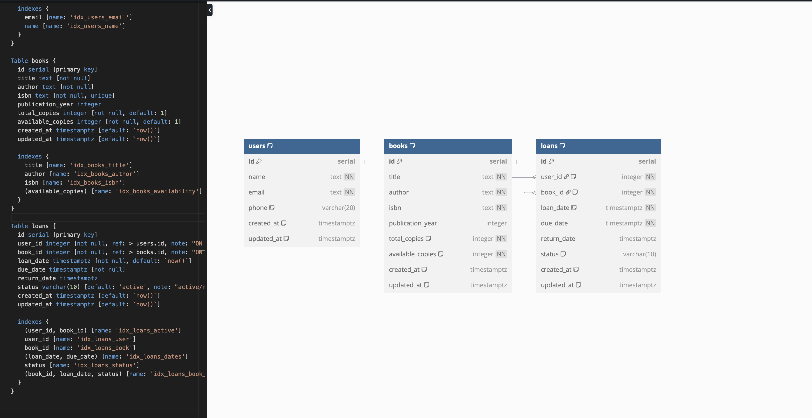

# Library Management System Database



A complete PostgreSQL database solution for library management systems.

## Features

- **User Management**: Track library members and their status
- **Book Inventory**: Manage book metadata and availability
- **Loan Tracking**: Record checkouts, returns, and overdue items


## Sample Output

```sql
 book_id |           title           |      author      | borrow_count
---------+---------------------------+------------------+--------------
      42 | The Great Gatsby          | F. Scott Fitzgerald | 12
      17 | 1984                     | George Orwell    | 9
      31 | To Kill a Mockingbird    | Harper Lee       | 7
```

## Contributing

1. Fork the repository
2. Create your feature branch (`git checkout -b feature/improvement`)
3. Commit your changes (`git commit -am 'Add some feature'`)
4. Push to the branch (`git push origin feature/improvement`)
5. Create a new Pull Request
